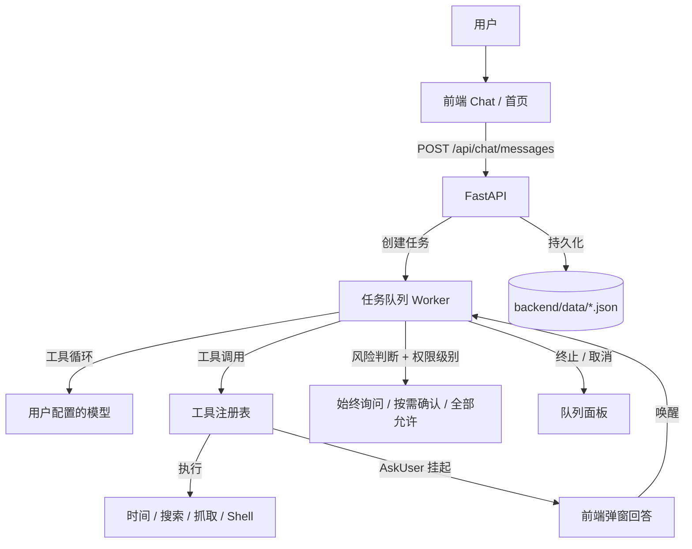

<p align="center">
  
</p>

# JIGSAW

JIGSAW 是一款把 AI 对话与可视化多 Agent 工作流融为一体的桌面应用。日常使用就是普通的 AI Chat；当任务需要多个 Agent 协作时，执行过程可以以工作流画布的形式呈现——每个节点做到哪一步、状态如何一目了然。

**核心体验：Chat → Workflow → Chat**

**当前状态**：前端 UI + FastAPI 后端 + 真实 LLM 链路（OpenAI 兼容接口）+ 工具调用 + 权限控制 + 异步任务队列 + 桌面壳。多 Agent 的真实编排（工作流执行）尚在规划，当前工作流画布为可视化原型。

## 核心功能

- **AI 对话**：接入用户自配模型（OpenAI 兼容接口，模型名 / baseUrl / API Key / 温度均可配）
- **工具系统**：内置 5 个工具（获取当前时间 / 网页搜索 / 网页抓取 / 执行命令 / 询问用户），工具广场可开关，对话气泡显示本轮用过的工具
- **权限控制**（Claude Code 式）：始终询问 / 按需确认 / 全部允许 三档；shell 危险命令识别；风险操作确认弹窗 + "不再提醒"勾选
- **AskUser 工具**：AI 挂起当前任务向用户提问，前端弹窗回答后唤醒继续执行
- **异步任务队列**：一次只回复一条、多余排队；实时显示进度（排队第几位 / 正在调用 XX 工具 / 等待用户回答）；支持终止（气泡 ✕ 或任务队列面板）
- **项目工作目录**：输入栏"项目"按钮选择目录，进入后 shell 命令在该目录执行，可随时退出
- **工作流画布**：无限画布、节点拖拽 / 连线 / 编辑 / 状态展示（可视化原型，未接真实执行）
- **持久化**：会话、消息、模型配置、工具开关均落盘 `backend/data/*.json`；历史删除同步后端

## 系统架构



## 技术栈

| 层  | 技术 |
| -- | -- |
| 前端 | 原生 JavaScript（无框架、无构建）、Hash Router、自绘组件 |
| 桌面 | Electron（单实例锁，`start-desktop.bat` 一键启动） |
| 后端 | Python · FastAPI · Uvicorn · 单 Worker 任务队列 |
| AI | langchain-openai（OpenAI 兼容接口） |
| 存储 | 前端 localStorage + `backend/data/` JSON 文件（会话 / 模型 / 工具开关） |

## 项目结构

```
Figsaw/
├── index.html            # 前端入口
├── assets/               # Logo 等静态资源
├── css/                  # 设计令牌 + 页面样式
├── js/
│   ├── core/             # dom / icons / store / router / markdown
│   ├── services/         # Http / Chat / Model / Tool / Settings 等服务层
│   ├── ui/               # 自绘组件（下拉 / 弹窗 / 任务队列面板）
│   └── views/            # 首页 / 聊天 / 工作流 / 设置 / 工具广场 / 历史
├── desktop/              # Electron 桌面壳（main.js 含单实例锁）
├── backend/
│   ├── main.py           # FastAPI 入口
│   ├── routers/          # chat / models / tools / agents / workflows / execution / settings
│   ├── services/         # chat_service(LLM 调用点) / task_service(任务队列)
│   ├── tools/            # 内置工具注册表（时间 / 搜索 / 抓取 / shell / AskUser）
│   └── data/             # 会话 / 模型 / 工具开关持久化（已 gitignore）
└── start-desktop.bat     # 一键启动：自动起后端 + 打开桌面窗口
```

## 运行

```
# 桌面版（推荐）：双击 start-desktop.bat
#   自动检查并启动后端（8000 端口），再打开 JIGSAW 窗口

# 手动启动后端：
cd backend && pip install -r requirements.txt
python -m uvicorn main:app --port 8000

# 网页版：直接打开 index.html，设置 → API 选「后端 API」
```

## 未来打算

- **计划中**：真实多 Agent 运行时（替换 `chat_service` 为编排器），工作流节点状态与聊天实时联动
- **计划中**：长期记忆 / 会话上下文持久化增强
- **计划中**：工具广场开放自定义工具（当前为内置注册表）
- **计划中**：打包发布为独立 EXE（electron-builder）

## License

MIT
