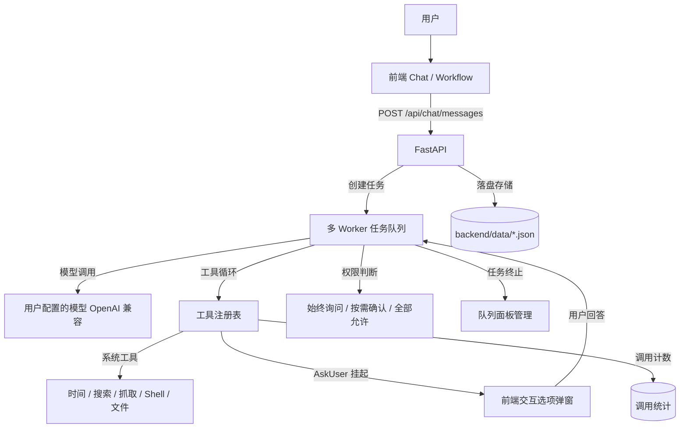

<p align="center">
  
</p>

# JIGSAW

JIGSAW 是一款把 AI 对话与可视化多 Agent 工作流融为一体的桌面应用。日常使用就是轻快纯粹的 AI Chat；当任务需要复杂编排与多个 Agent 协作时，执行过程可以以极简工业风的工作流画布呈现——每个节点做到哪一步、状态如何一目了然。

**核心体验：Chat ⇄ Workflow（双模自由流转，共用同一下下文）**

**当前状态**：前端 UI + FastAPI 后端 + 真实 LLM 链路（OpenAI 兼容接口，多模型并存）+ 工具调用 + 权限控制 + 异步任务队列（多 Worker 并发、可中断）+ 本地知识库（AI 可读写）+ 工具调用统计 + 曼哈顿正交布线与逻辑门工作流画布 + 桌面壳。

---

## 核心功能

### 1. 视图切换与顶栏架构
- **悬浮式视图切换器 (`.view-switch-float`)**：拒绝占用垂直空间的厚重双层白条，将 `[ 💬 对话 | ⚡ 工作流 ]` 做成轻量纯粹的悬浮控制胶囊，绝对居中锚定在视口顶端，对话与画布间自由切换，平滑无位移跳动。
- **顶栏标题靠左与即时编辑**：
  - 顶栏标题靠左与主页（左1）、历史记录（左2）图标组合排列，彻底消除左右两侧按钮宽度不对等导致的居中视觉偏差；
  - **行内无缝重命名**：鼠标悬停显示编辑铅笔图标，点击直接原地变为输入框，按 <kbd>Enter</kbd> 自动保存并弹出 Toast 提示，按 <kbd>Escape</kbd> 取消；
  - **历史记录列表重命名**：抽屉内每个会话卡片悬停提供 `[ ✏ 重命名 ]` 按钮，亦支持双击文字原地编辑；
  - **双向数据同步**：无论在顶栏还是历史抽屉修改，底层会话标题（`conv.title`）与工作流名称（`wf.name`）实时双向同步。
- **顶栏操作按钮像素级齐平**：彻底排除了弹层包裹容器带来的行盒基线（baseline）沉降与嵌套盒模型问题，所有操作按键顶边、中心线、底边严格像素级绝对对齐。

### 2. 工作流画布与多 Agent 编排系统
- **Void 全局空白画布**：默认不再塞入写死的 4 个 Mock Agent，避免为简单提问启动 5 个 AI 消耗资源；无论从 Chat 输入还是直接新建工作流，底层均初始化为纯净的 Void 画布（仅保留起始触发源 `START · 任务起点` 节点），节点编排完全交由用户自由设计。
- **工业级正交曼哈顿折线（Orthogonal Manhattan Routing）**：
  - 抛弃曲线，采用符合芯片与机械图纸美学的纯水平/垂直曼哈顿正交折线，并在 90° 拐弯处采用微圆角二阶贝塞尔过渡；
  - 具备**智能避障安全走廊**，自动计算安全引线与通道，防止折线穿透卡片本身；
  - **磁吸自动吸附（Auto-Snap）**：拖拽连线至目标输入端口 36px 范围内自动磁吸吸附并高亮放大端口；
  - **交互支持**：支持连线点击选中高亮、独立正交箭头 markers 标记、正交连线中央悬浮快捷删除按键，支持 <kbd>Delete</kbd> 快捷键删除选中连线或节点；按键监听内置**输入区智能隔离**，在输入框或文本域编辑时绝不拦截按键，并移除了容易引起误触的 <kbd>Backspace</kbd> 键。
- **控制流与逻辑门节点体系**：
  - 新增「逻辑控制」与「智能体」分类选项卡；
  - 内置丰富控制节点：**与门（AND 汇聚）**、**或门（OR 竞争）**、**非门（NOT 取反）**、**条件分支（IF）**、**循环闭环（Loop，支持轮次上限）**、**异常守护（Try-Catch）**；
  - 节点具备**异常容错策略（Error Policy）**：支持“失败自动跳过”或“注入预设兜底数据”，支持勾选模拟故障快速测试容错链路。
- **真实工具分配**：节点工具区改用后端真实注册的工具（ToolService ← `/api/tools`），旧数据残留的"幽灵工具"单独列出可一键移除。

### 3. AI 对话与模型管理
- **执行步骤实时轨迹（SVG 时间线）**：对话气泡内置可展开/折叠的执行过程轨迹，实时展示各步骤工具调用（排队中 / 运行中 / 完成 / 耗时 / 入参及输出结果摘要），AI 思考与工具调度过程全链路透明可视。
- **能力边界与精准系统提示词**：内置系统提示词清晰约束 AI 能力边界，支持本地知识库混合检索与安全落盘，明确声明未接入关系型数据库（如 MySQL/PostgreSQL）的操作边界，杜绝虚构数据库操作。
- **多模型并存**：接入用户自配模型（OpenAI 兼容接口，模型名 / baseUrl / API Key / 温度均可配）；「接口地址 + 模型 ID」都相同才算重复，同一模型 ID 挂不同服务商可并存；默认模型真实生效，删除模型加确认提示。
- **工具系统（内置 12 个工具）**：
  - 基础：获取当前时间 / 网页搜索（多关键词并发，Crawl4AI + 并发限流） / 网页抓取 / 计算器
  - 文件：文件内容读取（统一提取层，覆盖 Word / PDF / Excel / PPT）/ 文件编辑 / 应用代码补丁（apply_patch）
  - 知识库：`knowledge_search`（本地 RAG 向量语义与关键词切词 RRF 混合检索，自动降级）/ `knowledge_info`（查询结构）/ `knowledge_write`（落盘新建/追加/覆盖写入）
  - 执行与交互：执行 shell 命令 / 询问用户（AskUser，带选项按钮挂起等待）
- **AskUser 挂起交互**：AI 遇到不确定决策时挂起向用户提问，支持前端结构化渲染 A/B/C/D 快捷选项按钮，点选即回答；支持带提问序号去重与连续提问。
- **权限控制**：始终询问 / 按需确认 / 全部允许 三档权限；高危命令与覆盖写入支持确认弹窗与"不再提醒"；工具广场可随时重置提醒。
- **异步任务队列（多 Worker 并发、可真正中断）**：同会话串行、跨会话/跨模型并行（默认 4 并发 Worker，可调 1~16）；终止 1 秒内响应释放 Worker；任务队列面板支持消息查看、编辑与删除。

### 4. 本地知识库与 RAG 检索增强引擎
- **本地 RAG 混合检索体系**：内置本地向量嵌入引擎（默认基于轻量高性能的 `bge-small-zh` 模型，支持离线部署与国内镜像自动下载），长文档分块（Chunker）+ 向量计算 + 关键词切词扫描，采用 RRF（Reciprocal Rank Fusion，倒数排名融合算法）精准召回最相关原文片段，无依赖时优雅降级为关键词匹配。
- **文件树与多格式解析**：三栏文件树结构，支持子目录与嵌套分类；支持 Word / PDF / Excel / PPT 等多种格式内容提取；系统级隐藏文件（`.DS_Store` / `.git` 等）自动过滤。
- **项目工作目录**：输入栏一键选择工作目录，shell 命令与代码工具在该目录下隔离执行，可随时安全退出。
- **工具调用统计**：记录工具调用累计频次与最近时刻，支持按需一键重置，统计页与详情页自动实时刷新。
- **持久化**：会话、消息、模型配置、工具开关与权限、工作流、知识库数据落盘存储在 `backend/data/`。

---

## 视觉与设计系统规范

JIGSAW 遵循 **Systematic Grayscale** 工业设计语言：
1. **纯正黑白灰（No accent colors）**：放弃花哨的强调色，仅使用黑、白、中性灰阶，功能状态（如执行成功/失败/跳过）仅在指示灯或徽标上克制使用。
2. **绝对直角（Right angles only）**：全局采用硬朗的零圆角规则（`--radius: 0px`），保持机械仪表般的干练质感。
3. **高对比反色**：深色模式下主要操作为白底黑字，浅色模式下为深底白字，清晰醒目。
4. **拒绝冗余投影**：消除多余的模糊漫反射投影，界面元素靠 1px 微细边框分割层级。

---

## 系统架构



---

## 主要接口

| 接口 | 说明 |
| -- | -- |
| `POST /api/chat/messages` | 发送对话消息 → 异步推入队列并返回 `task_id` |
| `GET /api/chat/tasks/{id}` | 轮询任务状态（排队位次 / 工具调用 / 挂起待回答问题） |
| `POST /api/chat/tasks/{id}/answer` | 回答 AskUser 提问或确认高危操作 |
| `POST /api/chat/tasks/{id}/cancel` | 终止进行中或排队中的任务 |
| `GET /api/chat/tasks` | 获取任务队列面板完整列表 |
| `GET /api/stats` `POST /api/stats/reset` | 工具调用统计查询与重置 |
| `GET /api/tools` `POST /api/tools/*` | 获取工具列表、设置总开关、调整权限档位、配置项目路径 |
| `GET /api/knowledge/*` | 知识库分类文件树管理、文档预览与写入 |

---

## 技术栈

| 层级 | 技术选型 |
| -- | -- |
| 前端 | 原生 JavaScript（ES6+，无编译打包、零第三方 UI 框架）、Hash Router、自研响应式微 Store、正交 SVG 连线系统 |
| 桌面端 | Electron（具备单实例锁，`start-desktop.bat` 一键拉起） |
| 后端 | Python 3.10+ · FastAPI · Uvicorn · asyncio 并发任务调度 |
| AI 与编排 | OpenAI 兼容标准接口 · Function Calling 工具调用循环 |
| 存储 | 前端 localStorage + 后端 `backend/data/` JSON 持久化 |

---

## 目录结构

```
Jigsaw/
├── index.html            # 前端入口（资源通过 ?v= 破缓存）
├── assets/               # 矢量 Logo 与图标资源
├── css/                  # 样式体系
│   ├── tokens.css        # 核心设计令牌（Systematic Grayscale、直角、间距）
│   ├── components.css    # 通用组件（顶栏、按钮、输入框、悬浮切换条、弹窗、抽屉）
│   ├── home.css          # 首页极简仪表盘样式
│   ├── chat.css          # 对话与气泡流式排版样式
│   └── workflow.css      # 工作流画布、正交连线、节点卡片、检查器样式
├── js/
│   ├── core/             # dom / icons / store / router / markdown 等基础设施
│   ├── services/         # Http / Chat / Model / Tool / Workflow / Execution 服务层
│   ├── ui/               # 自绘控件（Dropdown / AskModal / QueuePanel 等）
│   └── views/            # 首页 / 聊天 / 工作流 / 设置 / 工具广场 / 历史 / 知识库
├── desktop/              # Electron 桌面外壳（main.js）
├── backend/
│   ├── main.py           # FastAPI 入口
│   ├── routers/          # 各领域路由（chat / models / tools / stats / knowledge 等）
│   ├── services/         # task_service / chat_service / kb_fs / stats_service
│   ├── tools/            # 内置工具实现与统一文件提取层
│   └── data/             # 会话 / 模型 / 工具配置等本地持久化数据（已 gitignore）
└── start-desktop.bat     # 一键启动脚本：自检并拉起后端 + 启动桌面应用
```

---

## 运行方式

```bash
# 桌面版（推荐）：直接双击运行
start-desktop.bat
# 脚本会自动检查 Python 虚拟环境与依赖，启动后端（8000端口）并打开桌面窗口

# 手动启动后端：
cd backend
pip install -r requirements.txt
python -m uvicorn main:app --port 8000

# 纯网页端调试：
# 在浏览器直接打开 index.html 即可使用前端，设置 -> API 选择「后端 API」
```

> **提示**：修改前端静态文件后，建议在 `index.html` 对应引入的标签后递增 `?v=` 版本号以破除浏览器/客户端缓存。

---

## 更新日志

### 最新迭代（当前版本）
- **本地 RAG 检索增强引擎与混合检索**：
  - 新增独立 RAG 模块（`backend/services/rag/`），内置本地向量模型管理器，支持 HuggingFace 镜像自动下载与离线加载（`bge-small-zh`）；
  - 实现文本智能分块（Chunker）、向量化（Embedding）与轻量向量库；
  - `knowledge_search` 升级为「关键词精确切词 + 语义向量召回」双路检索，通过 RRF（倒数排名融合）多路召回最相关上下文，依赖未就绪时自动平滑降级。
- **对话执行步骤实时轨迹（SVG 时间线）**：
  - 对话气泡内集成执行步骤折叠卡片，实时以 SVG 动态节点链渲染多步工具调用的执行状态（等待 / 运行中 / 完成 / 失败 / 耗时）；
  - 支持展开查看每步调用的工具名称、参数详情与执行返回结果摘要，全过程透明可追溯。
- **画布按键误触防护与输入隔离**：
  - 全局键盘事件监听引入光标焦点智能检测（`input, textarea, select, [contenteditable]`），在任何文本输入状态下绝对不拦截按键；
  - 画布删除快捷键精简为标准 <kbd>Delete</kbd> 键，彻底移除容易引起误删的 <kbd>Backspace</kbd> 退格键。
- **System Prompt 能力边界规范**：
  - 明确声明知识库语义检索与安全落盘能力，界定当前尚未接入关系型数据库（如 MySQL/PostgreSQL）的能力边界，杜绝虚构数据库查询。
- **工业级正交曼哈顿布线系统**：
  - 抛弃曲线，升级为微圆角纯正交折线布线算法；
  - 智能避障计算，消除穿透卡片的问题；
  - 输入端口具备 36px 磁吸吸附（Auto-Snap）与视觉提示，连线支持选中高亮与删除。
- **Void 全局空白画布规范**：
  - 彻底移除了原先写死的 4 个 Mock Agent，进入画布默认仅呈现单个 `START` 节点，告别单次提问滥用 5 个 AI。
- **控制流与逻辑门节点引擎**：
  - 新增与门、或门、非门、IF 条件分支、Loop 循环、Try-Catch 守护节点；
  - 卡片集成异常容错策略（失败跳过 / 注入兜底输出）与模拟故障测试开关。
- **顶栏架构重构与悬浮切换器**：
  - 移除占据屏幕垂直高度的笨重通栏，改为绝对居中的悬浮模式胶囊（`.view-switch-float`）；
  - 顶栏标题靠左与导航图标并排，排版舒展利落。
- **标题多端联动即时编辑**：
  - 顶栏标题支持悬停显示铅笔图标，点击原地行内编辑，按 <kbd>Enter</kbd> 保存，按 <kbd>Escape</kbd> 取消；
  - 历史记录抽屉支持每项重命名按钮与双击文字编辑，底层会话标题与工作流名称双向实时联动。
- **操作按钮像素级齐平对齐与界面清理**：
  - 修复添加节点弹层包裹容器引起的 baseline 沉降，顶栏右侧按钮顶底边框严格绝对齐平；
  - 清理关于页与设置页无效占位链接与选项，保持 Systematic Grayscale 纯正工程质感。

### 历史里程碑
- **多 Worker 并发异步任务队列**：跨会话/跨模型多任务并行，可即时秒级取消中断慢工具与模型调用。
- **多模型服务商共存与真实落盘**：同一模型 ID 挂不同供应商并存，支持默认模型与上下文配置。
- **AI 真正读写本地知识库**：三栏文件树、嵌套目录、隐藏文件过滤，集成 `knowledge_search` / `info` / `write`。
- **AskUser 结构化选项提问**：任务挂起支持 A/B/C/D 快捷选项弹窗，带序号去重与连续追问。
- **多关键词并发网页搜索**：`websearch` 升级为 `queries` 数组并发抓取，信号量安全限流。
- **Claude Code 式权限分级**：始终询问 / 按需确认 / 全部允许，支持高危操作提醒与"不再提醒"。

---

## License

MIT
