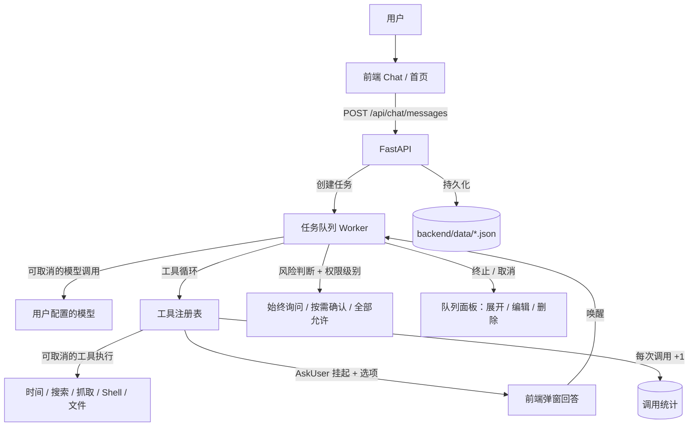

<p align="center">
  
</p>

# JIGSAW

JIGSAW 是一款把 AI 对话与可视化多 Agent 工作流融为一体的桌面应用。日常使用就是普通的 AI Chat；当任务需要多个 Agent 协作时，执行过程可以以工作流画布的形式呈现——每个节点做到哪一步、状态如何一目了然。

**核心体验：Chat → Workflow → Chat**

**当前状态**：前端 UI + FastAPI 后端 + 真实 LLM 链路（OpenAI 兼容接口，多模型并存）+ 工具调用 + 权限控制 + 异步任务队列（多 Worker 并发、可中断）+ 本地知识库（AI 可读写）+ 工具调用统计 + 桌面壳。多 Agent 的真实编排（工作流执行）尚在规划，当前工作流画布为可视化原型。

## 核心功能

- **AI 对话**：接入用户自配模型（OpenAI 兼容接口，模型名 / baseUrl / API Key / 温度均可配）；**多模型可并存**——「接口地址 + 模型 ID」都相同才算重复，同一模型 ID 挂不同服务商（如两家都叫 deepseek-chat）可以同时存在；设置里的「默认模型」真实生效（新建会话优先使用，以前设了不生效）
- **工具系统**：内置 12 个工具，工具广场可开关，对话气泡显示本轮用过的工具
  - 基础：获取当前时间 / 网页搜索 / 网页抓取 / 计算
    - **网页搜索支持多关键词并发**：参数为 `queries` 数组，基于 Crawl4AI 抓取 Bing 结果页（渲染 JS + 正文去噪），`asyncio` 并发执行并用信号量限流（同时最多 5 条，条数不设硬上限）；单条失败不影响其余，结果按 `==== Query: xxx ====` 分段汇总，每条截断 4000 字
  - 文件：读取文件（统一提取层，覆盖 Word / PDF / Excel / PPT）/ 编辑文件 / 应用补丁（apply_patch）
  - 知识库：`knowledge_search`（关键词检索原文片段，整句切词 + 中英混排命中）/ `knowledge_info`（查询知识库存放位置与目录结构）/ `knowledge_write`（新建 / 追加 / 覆盖写入，用户说"记到知识库里"时真正落盘）
  - 执行：执行命令（shell）
  - 交互：询问用户（AskUser）
- **AskUser 工具（带可点选项）**：AI 挂起当前任务向用户提问，前端弹窗回答后唤醒继续执行
  - 支持结构化 `options`（最多 4 项）→ 前端渲染成 **A/B/C/D 可点按钮**，点一下就回答，不用手打；也保留自由输入框
  - 用「提问序号」去重：同一个问题只弹一次，答完立即清空挂起状态，不会反复弹窗
  - 同一任务内可以连续问多个问题（序号递增，逐个弹）
- **权限控制**（Claude Code 式）：始终询问 / 按需确认 / 全部允许 三档；shell 危险命令识别、知识库覆盖写入（knowledge_write overwrite）同样走风险确认；风险操作确认弹窗 + "不再提醒"勾选
  - 勾选"不再提醒"后，**按需确认 / 全部允许两种模式都不再弹窗**；工具广场的「风险操作提醒」开关可随时恢复每次提醒
  - 用户在确认弹窗点"确认"后**真正执行该工具**；点"取消"则跳过并把结果告知模型
- **异步任务队列（多 Worker 并发、可真正中断）**：同一会话内一次只回复一条、多余排队；**不同会话 / 不同模型可以并行处理**（默认 4 个并发 Worker，`data/task_workers.json` 可调 1–16，重启后端生效）；实时显示进度（排队第几位 / 正在调用 XX 工具 / 等待用户回答）
  - **终止即时生效**：模型调用与慢工具（shell / 网页搜索 / 抓取 / 补丁等）都在可取消通道里跑，点终止后 1 秒内释放 Worker，后续排队任务立刻推进（不再卡在长达 120 秒的命令或模型调用上）
- **任务队列面板**：处理中的任务可**展开看全文**、**逐条终止**（按会话）；还没发出去的排队消息可**编辑 / 删除**（删除会连同会话里的"排队中"占位气泡一起消失）。输入栏的「N 个回复中 · +排队数」徽标可点击直接打开
- **本地知识库**：三栏文件树（根目录 + 分类 + 文档），**支持嵌套分类**（子目录在树里一并展示，重命名 / 删除 / 建文档都按相对路径处理）；拖拽导入、重命名 / 删除 / 新建，知识库存放目录可换；支持 Word / PDF / Excel / PPT 等二进制文件入库（无法预览但可管理）；**隐藏文件统一过滤**——`.DS_Store` / `Thumbs.db` / `.git` / 带隐藏属性的文件在页面与 AI 工具里一律不可见、不可读写，判定逻辑统一在 `services/kb_fs.py`；AI 侧三件套：`knowledge_search`（全量扫描关键词检索原文片段，整句切词 + 中英混排命中、单篇 8 条 / 全局 40 条上限）、`knowledge_info`（查询库存放位置与目录结构）、`knowledge_write`（新建 / 追加 / 覆盖写入，覆盖为风险操作需确认）
- **工具调用统计**：记录每个工具被调用的累计次数与最近一次调用时间，并给出**统计起始时刻**（`YYYYMMDD HH:mm:ss 时区`）。工具详情页可直接看到该工具的调用次数；设置 → 统计 可查看总数 / 各工具次数，并一键**重置统计**（次数清零 + 起始时刻更新为当前时刻）；**统计页 3 秒 / 工具详情页 5 秒自动刷新**，任务完成后也会顺手刷新，数字不再停留在旧值
- **项目工作目录**：输入栏"项目"按钮选择目录，进入后 shell 命令在该目录执行，可随时退出
- **工作流画布**：无限画布、节点拖拽 / 连线 / 编辑 / 状态展示；**节点工具区改用后端真实注册的工具**（ToolService ← `/api/tools`，不再写死假工具名），旧数据里残留的"幽灵工具"单独列出可一键移除；连线命中放宽（端口 + 节点任意位置），拖线时输入端口高亮（可视化原型，未接真实执行）
- **持久化**：会话、消息、模型配置、工具开关与权限、调用统计、知识库、并发 Worker 数均落盘 `backend/data/`（已 gitignore，不上传）

## 系统架构



## 主要接口

| 接口 | 说明 |
| -- | -- |
| `POST /api/chat/messages` | 发消息 → 立即返回 `task_id`（异步处理） |
| `GET /api/chat/tasks/{id}` | 轮询任务状态：排队位次 / 实时工具调用 / 待回答问题（含可选项与提问序号） |
| `POST /api/chat/tasks/{id}/answer` | 回答提问或确认风险操作（`noMore=true` 表示勾选"不再提醒"） |
| `POST /api/chat/tasks/{id}/cancel` | 终止任务（排队中 / 处理中 / 卡在提问都能停） |
| `GET /api/chat/tasks` | 队列面板数据（含完整消息内容） |
| `GET /api/stats` `POST /api/stats/reset` | 工具调用统计查询 / 重置 |
| `GET /api/tools` `POST /api/tools/*` | 工具列表、总开关、权限级别、风险提醒开关、项目工作目录 |

## 技术栈

| 层  | 技术 |
| -- | -- |
| 前端 | 原生 JavaScript（无框架、无构建）、Hash Router、自绘组件 |
| 桌面 | Electron（单实例锁，`start-desktop.bat` 一键启动） |
| 后端 | Python · FastAPI · Uvicorn · 多 Worker 并发任务队列（可中断） |
| AI | langchain-openai（OpenAI 兼容接口）· 工具循环（function calling） |
| 存储 | 前端 localStorage + `backend/data/` JSON 文件（会话 / 模型 / 工具开关与权限 / 调用统计） |

## 项目结构

```
Figsaw/
├── index.html            # 前端入口（改完记得同步升 ?v= 破缓存）
├── assets/               # Logo 等静态资源
├── css/                  # 设计令牌 + 页面样式
├── js/
│   ├── core/             # dom / icons / store / router / markdown
│   ├── services/         # Http / Chat / Model / Tool / Settings 等服务层
│   ├── ui/               # 自绘组件（下拉 / 弹窗 / 提示 / PromptModal / 任务队列面板）
│   └── views/            # 首页 / 聊天 / 工作流 / 设置 / 工具广场 / 历史 / 知识库
├── desktop/              # Electron 桌面壳（main.js 含单实例锁）
├── backend/
│   ├── main.py           # FastAPI 入口
│   ├── routers/          # chat / models / tools / stats / agents / workflows / execution / settings / knowledge
│   ├── services/         # chat_service(LLM 调用点) / task_service(多 Worker 任务队列) / kb_fs(知识库文件系统公共层) / stats_service(调用统计) / store
│   ├── tools/            # 内置工具注册表（含 knowledge_search / knowledge_info / knowledge_write）+ 统一文件提取层 extract.py + ask_user(挂起/唤醒)
│   └── data/             # 会话 / 模型 / 工具开关 / 调用统计 / 知识库（已 gitignore，不上传）
└── start-desktop.bat     # 一键启动：自动起后端 + 打开桌面窗口
```

## 运行

```
# 桌面版（推荐）：双击 start-desktop.bat
#   自动检查并启动后端（8000 端口），再打开 JIGSAW 窗口

# 手动启动后端：
cd backend && pip install -r requirements.txt
python -m uvicorn main:app --port 8000

# 网页版：直接打开 index.html，设置 → API 选「后端 API」
```

> 改完前端代码后，记得把 `index.html` 里对应资源的 `?v=` 数字 +1，否则窗口会吃旧缓存。

## 更新日志

### 未发布（当前工作区）
- **任务队列升级为多 Worker 并发** —— 同会话仍串行、跨会话 / 跨模型并行；默认 4 个并发 Worker（`data/task_workers.json` 可调 1–16，重启后端生效）；`/api/health` 返回 `workers` / `running`；前端消息队列同步改为按会话隔离，徽标显示「N 个回复中」，终止按会话生效
- **多模型并存** —— 「接口地址 + 模型 ID」相同才算重复，同一模型 ID 挂不同服务商可并存；设置里的「默认模型」真实生效（以前设了不生效）；删除模型加确认弹窗，模型被删后会话不再张冠李戴显示成列表第一个
- **知识库：嵌套分类 + 隐藏文件过滤** —— 子目录在文件树中扁平化展示；隐藏判定统一到 `services/kb_fs.py`（页面与 AI 工具共用一份，`.DS_Store` / `Thumbs.db` / `.git` / 带隐藏属性的文件一律不可见、不可读写）；删除被其他程序占用的文件 / 文件夹给出明确报错
- **AI 可真正读写知识库** —— 新增 `knowledge_info`（查存放位置与结构）与 `knowledge_write`（新建 / 追加 / 覆盖）两个工具，系统提示词强制 AI 说"已添加"前必须真正落盘；`knowledge_search` 升级：整句切词 + 中英混排命中、跳过隐藏项、单篇 8 条 / 全局 40 条上限；覆盖写入视为风险操作需确认
- **工作流画布工具区改为真实工具** —— 工具列表来自后端注册表（ToolService ← `/api/tools`），不再写死假工具名；旧数据残留的"幽灵工具"单独列出可一键移除；连线命中放宽（端口 + 节点任意位置），拖线时输入端口高亮，edge 颜色加深加粗
- **工具调用统计实时刷新** —— 统计页 3 秒 / 工具详情页 5 秒自动刷新，任务完成后顺手刷新，数字不再停留在旧值
- **体验修复** —— 聊天输入框重渲染保留草稿（不丢正在打的字）；AskUser 弹窗在别的任务已弹窗时排队等待、不抢占；知识库页面操作统一错误提示（后端未启动不再白屏）；工具总开关防重复绑定；工作流连线 SVG 改为循环清子节点
- **网页搜索升级为多关键词并发**：`websearch` 参数由 `query` 改为 `queries` 数组，`asyncio` 并发 + 信号量限流（同时最多 5 条），单条失败不中断整体
  - 顺带修掉一个必崩隐患：信号量原先是模块级对象，被多次 `asyncio.run()`（每次新建事件循环）复用 → 只要并发真的排队，第二次调用就抛 `is bound to a different event loop`。改为每次调用新建信号量
- **修复：终止任务不生效** —— 模型调用与慢工具改为可取消（子线程执行 + 轮询取消标记），终止后 1 秒内释放 Worker，排队任务立刻推进
- **修复：勾选"不再提醒"后仍弹风险确认** —— 权限判断条件写错，"按需确认"档把勾选状态短路掉了；同时新增工具广场的「风险操作提醒」开关作为恢复入口
- **修复：AskUser 提问交互异常** —— ① 答题后未清除挂起状态，导致前端每 2 秒把同一问题反复弹窗；② 提问只支持单个输入框，A/B/C/D 只能塞在题目文字里。现在加了「提问序号」去重 + 结构化 `options` 可点按钮
- **新增：任务队列面板可操作** —— 行可展开看全文；排队中消息支持编辑 / 删除（同步移除占位气泡）；「正在回复 · +N」徽标可点击打开面板
- **新增：工具调用统计** —— 工具详情显示调用次数与最近一次；设置 → 统计 显示记录起始时刻、总数、各工具次数，可一键重置
- **修复：设计令牌缺失与按钮悬停文字不可见** —— 补齐 `--bg-1/--bg-2/--bd/--fg/--mono` 等被引用却未定义的变量（知识库悬停高亮、`.btn:hover` 因此恢复）；`.ask-btn-primary:hover` 显式写回文字色，修掉"悬停后按钮文字消失"

### 知识库与工具扩充 · `bc25c62`
- 新增知识库管理界面（三栏文件树、拖拽导入、重命名/删除/新建、存放目录可换）
- 新增工具：`apply_patch` / `editfile` / `read_extra` / `calc` / `knowledge_search`，以及统一文件提取层 `extract.py`
- 尚未接入 RAG（当前为全量扫描关键词匹配）

### 权限与任务队列 · `c19a705`
- 新增项目目录选择、"始终询问 / 按需确认 / 全部允许"三档权限、任务队列面板与终止
- 输入框高度自适应，调整最大高度与溢出处理；shell 提示词优化

### 工具链路与持久化 · `6a3691c`
- 代码持久化（会话 / 模型落盘到 `backend/data/`）、工具调用链路打通、工具设置界面
- 新增 `get_current_time` / `websearch` 两个基础工具

### 早期原型 · `4e7934d` → `e315743`
- 首页新增后端连接状态指示，随后改为输入框内小方块；首次提交 JIGSAW 早期原型

## 未来打算

- **计划中**：真实多 Agent 运行时（替换 `chat_service` 为编排器），工作流节点状态与聊天实时联动
- **计划中**：知识库升级为 RAG——提取缓存 → 倒排索引 → 向量检索（本地 embedding），当前为全量扫描关键词匹配
- **计划中**：工具广场开放自定义工具注册（当前为内置注册表）
- **计划中**：调用统计增加按天分布 / 工具广场常驻总次数
- **计划中**：页面刷新后恢复挂起的提问与进行中的任务（当前刷新会让任务卡在"等待回答"）
- **计划中**：打包发布为独立 EXE（electron-builder）

## License

MIT
