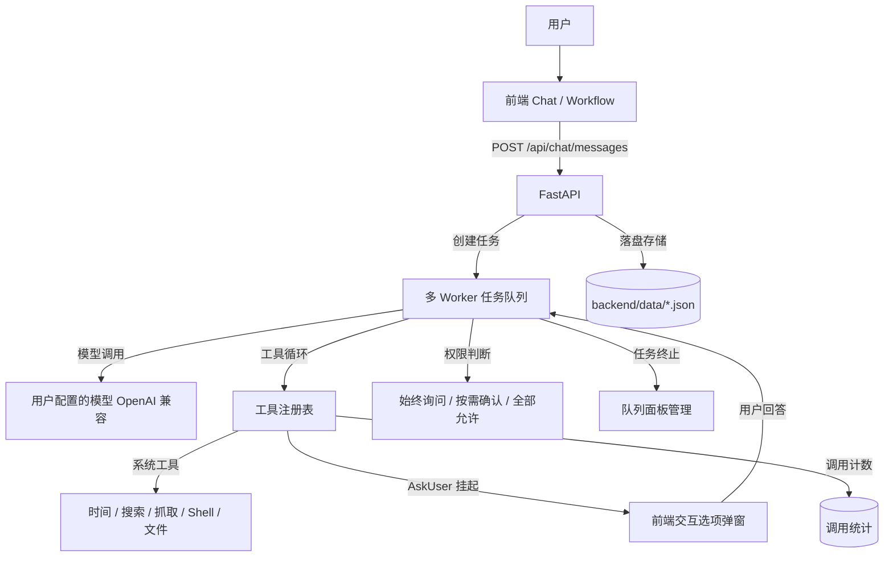

<p align="center">
  
</p>

# JIGSAW

JIGSAW 是一款把 AI 对话与可视化多 Agent 工作流融为一体的桌面应用。日常使用就是轻快纯粹的 AI Chat；当任务需要复杂编排与多个 Agent 协作时，执行过程可以以极简工业风的工作流画布呈现——每个节点做到哪一步、状态如何一目了然。

**核心体验：Chat ⇄ Workflow（双模自由流转，共用同一下下文）**

**当前状态**：前端 UI + FastAPI 后端 + 真实 LLM 链路（OpenAI 兼容接口，多模型并存）+ 工具调用（含通用生图与代码制图展示，13 个内置工具）+ 权限控制 + 异步任务队列（多 Worker 并发、可中断）+ 本地知识库（AI 可读写，RAG 向量语义混合检索）+ 思考链防抖稳定展示与大图灯箱 + 工具调用统计 + 曼哈顿正交布线与逻辑门工作流画布 + 桌面壳。

---

## 核心功能

### 1. 视图切换与顶栏架构
- **悬浮式视图切换器 (`.view-switch-float`)**：拒绝占用垂直空间的厚重双层白条，将 `[ 💬 对话 | ⚡ 工作流 ]` 做成轻量纯粹的悬浮控制胶囊，绝对居中锚定在视口顶端，对话与画布间自由切换，平滑无位移跳动。
- **顶栏标题靠左与即时编辑**：
  - 顶栏标题靠左与主页（左1）、历史记录（左2）图标组合排列，彻底消除左右两侧按钮宽度不对等导致的居中视觉偏差；
  - **行内无缝重命名**：鼠标悬停显示编辑铅笔图标，点击直接原地变为输入框，按 <kbd>Enter</kbd> 自动保存并弹出 Toast 提示，按 <kbd>Escape</kbd> 取消；
  - **历史记录列表重命名**：抽屉内每个会话卡片悬停提供 `[ ✏ 重命名 ]` 按钮，亦支持双击文字原地编辑；
  - **双向数据同步**：无论在顶栏还是历史抽屉修改，底层会话标题（`conv.title`）与工作流名称（`wf.name`）实时双向同步。
- **顶栏操作按钮像素级齐平**：彻底排除了弹层包裹容器带来的行盒基线（baseline）沉降与嵌套盒模型问题，所有操作按键顶边、中心线、底边严格像素级绝对对齐。

### 2. 工作流画布与多 Agent 编排系统
- **主页工作流模式一键直达（Instant Workflow Generation）**：
  - 首页支持「对话模式 · Chat」与「画布编排 · Workflow」双模无缝切换；
  - 在工作流模式下，输入任意任务目标直接敲击 <kbd>Enter</kbd>（或点击发送按钮），系统后台自动调用 **Captain Agent** 智能解构需求，完成多智能体拓扑规划与自动排版，秒级载入画布，实现“输入需求 ➔ 敲回车 ➔ 完整流水线即刻就绪”的一键直达体验；留空回车则保留纯净空白画布。
- **对齐工业级多 Agent 架构与多阶纵深流水线（Progressive Multi-Stage DAG）**：
  - 完整对齐 Anthropic 权威架构指南（Orchestrator-Workers、扇出并发与同步栅栏机制），彻底打破单层单调的“一锅端”玩具式拓扑：
    - **第一阶段【多维数据与事实情报层】**：并行业务探索，精准调用 `websearch` / `fetch_url` 抓取一手客观数据；
    - **同步栅栏（AND Gate）**：多路依赖自动注入逻辑与门，必须等待前置事实全部就绪后再流转，严禁下游节点抢跑；
    - **第二阶段【深度交叉分析与量化推演层】**：调用 `calc` 进行量化财务测算、CAGR 复合年均增长率与敏感性建模，并针对性解构技术壁垒与 SWOT / 波特五力；
    - **第三阶段【全局战略研判与决策总成层】**：聚合多维量化与战略洞察，输出结构严密的高管级综合研报；
    - **第四阶段【下游方案落地与行动拓展层】**：向后拓展可实操的阶段性实施路线图（Milestones、实施节奏、资源预算表与风险预案），并通过 `knowledge_write` 沉淀归档入知识库。
- **任务复杂度自适应动态伸缩（Dynamic Complexity Scaling）**：
  - **Tier 1 极简单点任务**（单句问答、简单润色、快速指令）：自动收敛为 1~2 个直接执行节点，拒绝繁琐门控，坚决杜绝“杀鸡用牛刀”；
  - **Tier 2 中度专项任务**（单一主题调研、产品对比、创意海报）：自动匹配为 3~4 个节点（2~3路并行前置探索 ➔ 终极总成交付）；
  - **Tier 3 复杂长文本/重型课题**（长篇需求、多维度商业规划、跨界战略推演）：自动展开为 5~7 节点、3~4 阶纵深流水线。
- **全链路时间基准感知（Time-Aware Multi-Agent Execution）**：
  - **工具配给**：为任何需要工具的 Agent 节点分配工具列表时，默认且强制附带 `get_current_time`（获取当前时间工具）；
  - **时间透传**：执行引擎与对话主控每次执行时，均强制提取本地精准时钟（年月日、时分秒及基准年份）注入提示词与上下文，彻底杜绝 AI 因预训练数据而产生的陈旧年份幻觉。
- **多端口分支控制与免拖拽配对（Multi-Port & Click-to-Connect）**：
  - 条件判断（IF）支持 `True` / `False` 独立输出端口，循环控制（Loop）支持 `Loop` / `Done` 独立端口，异常捕获支持 `Try` / `Catch` 端口；
  - 支持 **Click-to-Connect**：点击源端口进入呼吸脉冲态，直接点击目标端口即可秒级完成配对，消除长距离拖拽疲劳；
  - 分支连线带有 `[True]` / `[False]` / `[Loop]` 彩色胶囊微标，点击连线呼出检查器，支持实时修改标签。
- **执行期动态粒子流与分支分流（Active-Flow Execution）**：
  - 任务执行时连线呈现高亮发光粒子流冲刷动画（`.active-flow`）；
  - 智能分支分流：条件命中分支全速激活，未命中分支自动标记为浅灰跳过（`skipped`），下游孤立节点自动跳过。
- **工业级正交曼哈顿折线（Orthogonal Manhattan Routing）**：
  - 采用符合芯片图纸美学的纯正交折线，微圆角贝塞尔平滑过渡，内置防穿透智能避障算法与 36px 磁吸吸附（Auto-Snap）。
- **真实工具分配**：节点工具区改用后端真实注册的工具（ToolService ← `/api/tools`），旧数据残留的"幽灵工具"单独列出可一键移除。

### 3. AI 对话、图像生成与模型管理
- **专属思考与执行块（`.msg-thought` 防抖防跳动体系）**：
  - **解耦思考与正文**：实时进度文案（“思考中…/已等待 Xs/正在调用工具…”）与正文气泡完全解耦，正文打字前气泡保持静默，彻底消除气泡从满到空导致高度骤缩的剧烈上下抽动；
  - **位置恒定在顶部**：SVG 步骤轨迹与状态常驻在消息气泡上方，任务完成时不突然从 DOM 中销毁，不与工具标签调换位置，平滑收拢为工具摘要并支持随时点击展开/折叠回看完整轨迹；
  - **DOM-Preserving 增量更新（消除 55Hz 重建地震）**：打字机流式输出时自动保留已加载的真实 `` DOM 节点，杜绝每 18ms 销毁重建引发的高频剧烈震颤；
  - **图片语法原子化步进**：流式输出遇 `` 时一次性吐出完整标签，不逐字拆裂裸露破坏性语法；
  - **骨架占位与抗扰动锁底**：图片容器预留尺寸与 `contain: layout paint`；`scrollToBottom` 接入 `requestAnimationFrame` 帧同步，吸附阈值收紧为 `48px`，用户向上翻看历史时不霸道抢夺视口。
- **通用图像生成（`generate_image`）与画图全链路**：
  - 支持 OpenAI / Agnes AI / 硅基流动 FLUX / DALL-E 3 等多服务商规范，支持自动匹配画幅比例（`1:1`、`16:9`、`9:16`、`3:2`、`4:3` 等）；
  - 图片生成后自动下载/解码落盘至 `backend/data/generated_images/`；后端提供静态资源路由（`/api/files/raw?path=...`），前端 Markdown 渲染器自适应输出带有直角边框的图片卡片；
  - **多模型确认机制**：当用户配置了多个带有效密钥的生图模型且未指明时，AI 自动触发 `AskUser` 交互式确认弹窗；单个可用模型时直接流畅生成。
- **Python / MATLAB 代码制图自动渲染闭环**：
  - 不仅支持 AI 调生图模型作图，同时支持用户要求 AI 编写 Python (`matplotlib`) 或 MATLAB 脚本画图；脚本将图片存盘至本地并在对话中输出 ``，前端即可自动读取并高质量渲染显示，实现“写代码制图与看图”全链路闭环。
- **全屏大图灯箱预览（Image Lightbox）**：
  - 点击对话中任意生成的图片，一键唤起极简工业风全屏灯箱预览；支持一键复制原始本地路径、在新标签页打开原图，按 <kbd>Escape</kbd> 或点击暗色遮罩平滑退出。
- **生图模型统一管理**：
  - 生图模型配置并入“设置 → 模型”，打破孤立选项卡的割裂感；严格按实际填写的 API Key 管理模型，清理未填密钥的占位模型，做到“配置几个就是几个”；提供快捷预设模板按钮，仅作输入填充，不侵入真实配置。
- **能力边界与精准系统提示词**：内置系统提示词清晰约束 AI 能力边界，支持本地知识库混合检索与安全落盘，明确声明未接入关系型数据库（如 MySQL/PostgreSQL）的操作边界，杜绝虚构数据库操作。
- **多模型并存**：接入用户自配模型（OpenAI 兼容接口，模型名 / baseUrl / API Key / 温度均可配）；「接口地址 + 模型 ID」都相同才算重复，同一模型 ID 挂不同服务商可并存；默认模型真实生效，删除模型加确认提示。
- **工具系统（内置 13 个工具）**：
  - 基础：获取当前时间 / 网页搜索（多关键词并发，Crawl4AI + 并发限流） / 网页抓取 / 计算器
  - 图像：通用图像生成（`generate_image`，支持主流服务商与画幅定制）
  - 文件：文件内容读取（统一提取层，覆盖 Word / PDF / Excel / PPT）/ 文件编辑 / 应用代码补丁（apply_patch）
  - 知识库：`knowledge_search`（本地 RAG 向量语义与关键词切词 RRF 混合检索，自动降级）/ `knowledge_info`（查询结构）/ `knowledge_write`（落盘新建/追加/覆盖写入）
  - 执行与交互：执行 shell 命令 / 询问用户（AskUser，带选项按钮挂起等待）
- **AskUser 挂起交互**：AI 遇到不确定决策时挂起向用户提问，支持前端结构化渲染 A/B/C/D 快捷选项按钮，点选即回答；支持带提问序号去重与连续提问。
- **权限控制**：始终询问 / 按需确认 / 全部允许 三档权限；高危命令与覆盖写入支持确认弹窗与"不再提醒"；工具广场可随时重置提醒。
- **异步任务队列（多 Worker 并发、可真正中断）**：同会话串行、跨会话/跨模型并行（默认 4 并发 Worker，可调 1~16）；终止 1 秒内响应释放 Worker；任务队列面板支持消息查看、编辑与删除。

### 4. 本地知识库与 RAG 检索增强引擎
- **本地 RAG 混合检索体系**：内置本地向量嵌入引擎（默认基于轻量高性能的 `bge-small-zh` 模型，支持离线部署与国内镜像自动下载），长文档分块（Chunker）+ 向量计算 + 关键词切词扫描，采用 RRF（Reciprocal Rank Fusion，倒数排名融合算法）精准召回最相关原文片段，无依赖时优雅降级为关键词匹配。
- **文件树与多格式解析**：三栏文件树结构，支持子目录与嵌套分类；支持 Word / PDF / Excel / PPT 等多种格式内容提取；系统级隐藏文件（`.DS_Store` / `.git` 等）自动过滤。
- **项目工作目录**：输入栏一键选择工作目录，shell 命令与代码工具在该目录下隔离执行，可随时安全退出。
- **工具调用统计**：记录工具调用累计频次与最近时刻，支持按需一键重置，统计页与详情页自动实时刷新。
- **持久化**：会话、消息、模型配置、工具开关与权限、工作流、知识库数据落盘存储在 `backend/data/`。

---

## 视觉与设计系统规范

JIGSAW 遵循 **Systematic Grayscale** 工业设计语言：
1. **纯正黑白灰（No accent colors）**：放弃花哨的强调色，仅使用黑、白、中性灰阶，功能状态（如执行成功/失败/跳过）仅在指示灯或徽标上克制使用。
2. **绝对直角（Right angles only）**：全局采用硬朗的零圆角规则（`--radius: 0px`），保持机械仪表般的干练质感。
3. **高对比反色**：深色模式下主要操作为白底黑字，浅色模式下为深底白字，清晰醒目。
4. **拒绝冗余投影**：消除多余的模糊漫反射投影，界面元素靠 1px 微细边框分割层级。

---

## 系统架构



---

## 主要接口

| 接口 | 说明 |
| -- | -- |
| `POST /api/chat/messages` | 发送对话消息 → 异步推入队列并返回 `task_id` |
| `GET /api/chat/tasks/{id}` | 轮询任务状态（排队位次 / 工具调用 / 挂起待回答问题） |
| `POST /api/chat/tasks/{id}/answer` | 回答 AskUser 提问或确认高危操作 |
| `POST /api/chat/tasks/{id}/cancel` | 终止进行中或排队中的任务 |
| `GET /api/chat/tasks` | 获取任务队列面板完整列表 |
| `GET /api/stats` `POST /api/stats/reset` | 工具调用统计查询与重置 |
| `GET /api/tools` `POST /api/tools/*` | 获取工具列表、设置总开关、调整权限档位、配置项目路径 |
| `GET /api/knowledge/*` | 知识库分类文件树管理、文档预览与写入 |
| `GET /api/files/raw` | 本地生成图片与多媒体文件读取流（支持防抖渲染与大图灯箱） |

---

## 技术栈

| 层级 | 技术选型 |
| -- | -- |
| 前端 | 原生 JavaScript（ES6+，无编译打包、零第三方 UI 框架）、Hash Router、自研响应式微 Store、正交 SVG 连线系统 |
| 桌面端 | Electron（具备单实例锁，`start-desktop.bat` 一键拉起） |
| 后端 | Python 3.10+ · FastAPI · Uvicorn · asyncio 并发任务调度 |
| AI 与编排 | OpenAI 兼容标准接口 · Function Calling 工具调用循环 · 图像生成 API |
| 存储 | 前端 localStorage + 后端 `backend/data/` JSON 与本地图片持久化 |

---

## 目录结构

```
Jigsaw/
├── index.html            # 前端入口（资源通过 ?v= 破缓存）
├── assets/               # 矢量 Logo 与图标资源
├── css/                  # 样式体系
│   ├── tokens.css        # 核心设计令牌（Systematic Grayscale、直角、间距）
│   ├── components.css    # 通用组件（顶栏、按钮、输入框、悬浮切换条、弹窗、抽屉）
│   ├── home.css          # 首页极简仪表盘样式
│   ├── chat.css          # 对话与气泡流式排版样式（含思考块与灯箱样式）
│   └── workflow.css      # 工作流画布、正交连线、节点卡片、检查器样式
├── js/
│   ├── core/             # dom / icons / store / router / markdown 等基础设施
│   ├── services/         # Http / Chat / Model / Tool / Workflow / Execution 服务层
│   ├── ui/               # 自绘控件（Dropdown / AskModal / QueuePanel 等）
│   └── views/            # 首页 / 聊天 / 工作流 / 设置 / 工具广场 / 历史 / 知识库
├── desktop/              # Electron 桌面外壳（main.js）
├── backend/
│   ├── main.py           # FastAPI 入口
│   ├── routers/          # 各领域路由（chat / models / tools / stats / knowledge / files 等）
│   ├── services/         # task_service / chat_service / kb_fs / stats_service / rag
│   ├── tools/            # 内置工具实现（含 generate_image 通用生图与统一文件提取层）
│   └── data/             # 会话 / 模型 / 工具配置 / generated_images 生成图片库（已 gitignore）
└── start-desktop.bat     # 一键启动脚本：自检并拉起后端 + 启动桌面应用
```

---

## 运行方式

```bash
# 桌面版（推荐）：直接双击运行
start-desktop.bat
# 脚本会自动检查 Python 虚拟环境与依赖，启动后端（8000端口）并打开桌面窗口

# 手动启动后端：
cd backend
pip install -r requirements.txt
python -m uvicorn main:app --port 8000

# 纯网页端调试：
# 在浏览器直接打开 index.html 即可使用前端，设置 -> API 选择「后端 API」
```

> **提示**：修改前端静态文件后，建议在 `index.html` 对应引入的标签后递增 `?v=` 版本号以破除浏览器/客户端缓存。

---

## 更新日志

### 最新迭代（当前版本）
- **Captain Agent 多智能体自主规划与自适应纵深流水线（Progressive Multi-Stage DAG）**：
  - 完整对齐 Anthropic 权威多 Agent 架构设计（Orchestrator-Workers、扇出并发与同步栅栏机制），彻底告别单层单调的“一锅端”玩具式拓扑；
  - 工业级四阶纵深递进流水线：① 事实数据与情报层（`websearch` / `fetch_url` 并发探索）➔ ② 同步与门（AND Gate）汇聚 ➔ ③ 量化模型与商业战略深度解构层（`calc` 精准财务/CAGR测算与竞争壁垒解构）➔ ④ 高管战略决策研报与下游实施路线图（Milestones、落地节奏、资源预算、`knowledge_write` 知识沉淀）；
  - **任务复杂度自适应动态伸缩（Dynamic Complexity Scaling）**：单点任务 1~2 节点极简直达拒绝过度设计，中度任务 3~4 节点并行总成，长难课题 5~7 节点多阶纵深，兼顾轻快与深度。
- **主页工作流模式回车一键自动生成（Instant Workflow Generation）**：
  - 首页「画布编排 · Workflow」模式下，在输入框填入任务目标直接按 <kbd>Enter</kbd> 回车或点击发送，系统自动调用 Captain Agent 编排完整工作流并秒级跳转至画布，用户进画布即刻看到完整排版的工作流并可一键运行；留空回车则直达空白自由画布。
- **全链路时间基准感知与时钟透传（Time-Aware System）**：
  - 为所有具备工具能力的智能体节点分配工具列表时，强制自动配给 `get_current_time`（获取当前时间工具）；
  - 执行引擎与对话主控每次执行时，均强制抓取本地高精度实时时钟注入系统提示词与上下文，彻底杜绝 AI 因预训练数据而产生的陈旧年份假定与幻觉。
- **多端口多分支连线与粒子流分支流转引擎**：
  - 条件判断（IF）支持 True / False 独立输出端口，循环控制（Loop）支持 Loop / Done 端口，异常捕获支持 Try / Catch 端口；
  - 引入 **Click-to-Connect** 免拖拽点击配对、正交连线微徽标（`[True]` / `[False]`）与连线检查器；
  - 执行期 `.active-flow` 发光粒子流冲刷动画，支持条件动态分流与未命中分支自动 `skipped`。
- **对话与多 Agent 执行成果聚合优化**：
  - 彻底优化工作流多 Agent 执行成果聚合逻辑，按时序完整呈现所有参与 Agent 的工作汇报，杜绝中间节点成果丢失；
  - 消除对话框中嵌入裸露 SVG 代码的冗余展示，清理多余生图假空标题与非生图图标误识别。
- **通用图像生成全链路与多模型调度（`generate_image`）**：
  - 接入通用图像生成工具，支持 OpenAI / Agnes AI / 硅基流动 FLUX / DALL-E 3 等模型与自适应画幅（`1:1`, `16:9`, `9:16`, `3:2` 等）；
  - 图像自动下载/解码落盘至 `backend/data/generated_images/`；
  - 接入静态流读取路由 `/api/files/raw` 与 Markdown 图片解析器，自动渲染带有直角工业风边框的图片卡片；
  - **多模型确认机制**：配置多个带密钥的生图模型且未指定时，AI 自动触发 `AskUser` 交互式确认弹窗，单个可用模型时流畅秒级调用。
- **思考链与执行过程稳定渲染架构（`.msg-thought` 防抖体系）**：
  - **解耦思考与正文**：实时进度文案（“思考中…/已等待 Xs/正在调用工具…”）与正文气泡完全解耦，正文打字前气泡保持静默，彻底消除气泡从满到空导致高度骤缩的剧烈上下抽动；
  - **位置恒定在顶部**：SVG 步骤轨迹与状态常驻在消息气泡上方，任务完成时不突然从 DOM 中销毁，不与工具标签调换位置，平滑收拢为工具摘要并支持随时点击展开/折叠回看完整轨迹；
  - **DOM-Preserving 增量更新（消除 55Hz 重建地震）**：打字机流式输出时自动保留已加载的真实 `` DOM 节点，杜绝每 18ms 销毁重建引发的高频剧烈震颤；
  - **图片语法原子化步进**：流式输出遇 `` 时一次性吐出完整标签，不逐字拆裂裸露破坏性语法；
  - **骨架占位与抗扰动锁底**：图片容器预留尺寸与 `contain: layout paint`；`scrollToBottom` 接入 `requestAnimationFrame` 帧同步，吸附阈值收紧为 `48px`，用户向上翻看历史时不霸道抢夺视口。
- **全屏大图灯箱预览（Image Lightbox）**：
  - 点击对话中生成的任意图片或图表，一键呼出极简工业风全屏大图灯箱预览；
  - 支持一键复制本地真实路径、在新标签页打开原图，按 <kbd>Escape</kbd> 或点击暗色遮罩退出。
- **生图模型统一管理与快捷模板**：
  - 生图模型配置并入“设置 → 模型”，打破孤立选项卡设计；
  - 严格按用户实际填写的 API Key 管理模型，清理未配置密钥的虚假占位模型，做到“配置几个就是几个”；
  - 提供快捷预设模板按钮，仅作输入填充，不侵入真实配置。
- **Python / MATLAB 绘图闭环支持**：
  - 规范绘图指南，支持 AI 编写 Python (`matplotlib`) 或 MATLAB 脚本画图落盘后，通过 Markdown `` 自动读取并渲染展示，形成完整的“写代码制图与看图”体验闭环。
- **本地 RAG 检索增强引擎与混合检索**：
  - 新增独立 RAG 模块（`backend/services/rag/`），内置本地向量模型管理器，支持 HuggingFace 镜像自动下载与离线加载（`bge-small-zh`）；
  - 实现文本智能分块（Chunker）、向量化（Embedding）与轻量向量库；
  - `knowledge_search` 升级为「关键词精确切词 + 语义向量召回」双路检索，通过 RRF（倒数排名融合）多路召回最相关上下文，依赖未就绪时自动平滑降级。
- **对话执行步骤实时轨迹（SVG 时间线）**：
  - 对话气泡内集成执行步骤折叠卡片，实时以 SVG 动态节点链渲染多步工具调用的执行状态（等待 / 运行中 / 完成 / 失败 / 耗时）；
  - 支持展开查看每步调用的工具名称、参数详情与执行返回结果摘要，全过程透明可追溯。
- **画布按键误触防护与输入隔离**：
  - 全局键盘事件监听引入光标焦点智能检测（`input, textarea, select, [contenteditable]`），在任何文本输入状态下绝对不拦截按键；
  - 画布删除快捷键精简为标准 <kbd>Delete</kbd> 键，彻底移除容易引起误删的 <kbd>Backspace</kbd> 退格键。
- **System Prompt 能力边界规范**：
  - 明确声明知识库语义检索与安全落盘能力，界定当前尚未接入关系型数据库（如 MySQL/PostgreSQL）的能力边界，杜绝虚构数据库查询。
- **工业级正交曼哈顿布线系统**：
  - 抛弃曲线，升级为微圆角纯正交折线布线算法；
  - 智能避障计算，消除穿透卡片的问题；
  - 输入端口具备 36px 磁吸吸附（Auto-Snap）与视觉提示，连线支持选中高亮与删除。
- **Void 全局空白画布规范**：
  - 彻底移除了原先写死的 4 个 Mock Agent，进入画布默认仅呈现单个 `START` 节点，告别单次提问滥用 5 个 AI。
- **控制流与逻辑门节点引擎**：
  - 新增与门、或门、非门、IF 条件分支、Loop 循环、Try-Catch 守护节点；
  - 卡片集成异常容错策略（失败跳过 / 注入兜底输出）与模拟故障测试开关。
- **顶栏架构重构与悬浮切换器**：
  - 移除占据屏幕垂直高度的笨重通栏，改为绝对居中的悬浮模式胶囊（`.view-switch-float`）；
  - 顶栏标题靠左与导航图标并排，排版舒展利落。
- **标题多端联动即时编辑**：
  - 顶栏标题支持悬停显示铅笔图标，点击原地行内编辑，按 <kbd>Enter</kbd> 保存，按 <kbd>Escape</kbd> 取消；
  - 历史记录抽屉支持每项重命名按钮与双击文字编辑，底层会话标题与工作流名称双向实时联动。
- **操作按钮像素级齐平对齐与界面清理**：
  - 修复添加节点弹层包裹容器引起的 baseline 沉降，顶栏右侧按钮顶底边框严格绝对齐平；
  - 清理关于页与设置页无效占位链接与选项，保持 Systematic Grayscale 纯正工程质感。

### 历史里程碑
- **多 Worker 并发异步任务队列**：跨会话/跨模型多任务并行，可即时秒级取消中断慢工具与模型调用。
- **多模型服务商共存与真实落盘**：同一模型 ID 挂不同供应商并存，支持默认模型与上下文配置。
- **AI 真正读写本地知识库**：三栏文件树、嵌套目录、隐藏文件过滤，集成 `knowledge_search` / `info` / `write`。
- **AskUser 结构化选项提问**：任务挂起支持 A/B/C/D 快捷选项弹窗，带序号去重与连续追问。
- **多关键词并发网页搜索**：`websearch` 升级为 `queries` 数组并发抓取，信号量安全限流。
- **Claude Code 式权限分级**：始终询问 / 按需确认 / 全部允许，支持高危操作提醒与"不再提醒"。

---

## License

MIT
