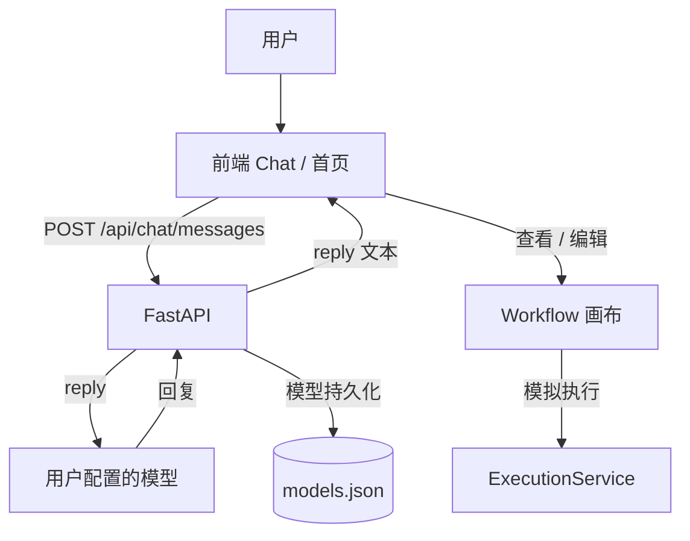

<p align="center">
  
</p>

# JIGSAW

JIGSAW 是一款将 AI 对话与可视化多 Agent 工作流融为一体的桌面应用。日常使用时它就是普通的 AI Chat；当任务需要多个 Agent 协作时，执行过程会以工作流画布的形式呈现——每个 Agent 做到哪一步、状态如何一目了然，尚未执行的节点仍可随时编辑调整。

**核心体验：Chat → Workflow → Chat**

**当前状态**：前端 UI 原型 + FastAPI 后端骨架。聊天已接通真实 LLM（OpenAI 兼容接口），Agent 执行为 Mock，尚未实现。

## 系统架构




## 技术栈


| 层  | 技术                                            |
| -- | --------------------------------------------- |
| 前端 | 原生 JavaScript（无框架、无构建）、Hash Router            |
| 桌面 | Electron                                      |
| 后端 | Python · FastAPI · Uvicorn                    |
| AI | langchain-openai（OpenAI 兼容接口）                 |
| 存储 | 前端 localStorage + 后端内存 + `models.json`（模型持久化） |

## 项目结构


```
Figsaw/

├── index.html            # 前端入口

├── assets/               # Logo 等静态资源

├── css/                  # 设计令牌 + 页面样式

├── js/

│   ├── core/             # dom / icons / store / router / markdown

│   ├── mocks/            # 种子数据（Agent 模板、工作流模板、设置）

│   ├── services/         # 服务层（Http / Chat / Model / Workflow / Execution / Settings）

│   ├── ui/               # 自绘组件

│   └── views/            # 首页 / 聊天 / 工作流 / 设置 / 历史

├── desktop/              # Electron 桌面壳

├── backend/

│   ├── main.py           # FastAPI 入口

│   ├── routers/          # chat / models / agents / workflows / execution / settings

│   ├── services/         # chat\_service(LLM 调用点) 等

│   └── data/models.json  # 模型持久化文件

└── backend/run.bat       # 一键启动后端
```

## 未来打算


* **已完成**：前端界面与交互、后端骨架、聊天真实链路、自定义模型管理 + 持久化

* **计划中**：真实 Agent 运行时（替换 `chat_service` / `execution_service`）、会话持久化、工作流状态与聊天联动、记忆

## 运行


```
\# 后端

cd backend && pip install -r requirements.txt

python -m uvicorn main:app --reload --port 8000

\# 桌面版：双击 start-desktop.bat（或 cd desktop && npm start）

\# 网页版：直接打开 index.html，设置 → API 选择「后端 API」后聊天走真实模型
```

## License

MIT